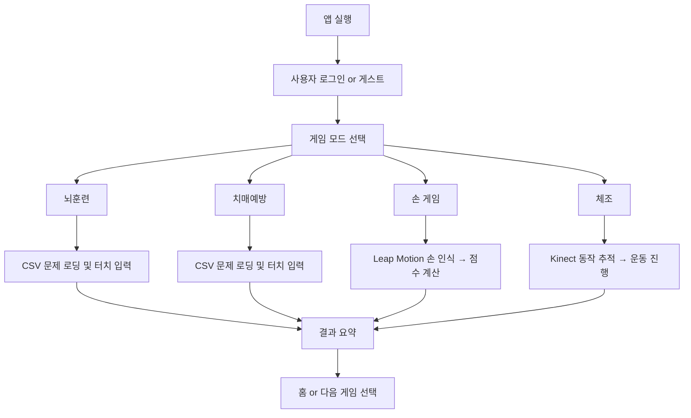

# 🧓 보자마자 케어 (Bojamaja Care)


> 터치, 손동작, 전신 인식을 통합한 **시니어 맞춤형 인지훈련 및 건강관리 시스템**

---

## 📌 프로젝트 개요

**보자마자 케어**는 터치 기반 뇌훈련, Leap Motion 기반 손동작 게임, Kinect 기반 전신 체조 콘텐츠로 구성된 시니어 인지훈련 프로그램입니다.  
안면 인식 기반 사용자 구분 및 스케줄 관리 기능을 통해 헬스케어 자동화에 기여합니다.

---

## 📅 개발 기간

**2022.06 ~ 2022.12 (7개월)**

---

## 🛠️ 기술 스택

- `Unity3D`
- `Leap Motion Controller`
- `Microsoft Kinect`
- `C#`
- `OpenCV (얼굴 인식)`

---

## 🧠 주요 기술 세부 설명

| 기능 영역                | 기술 / 클래스명                                          | 설명                                             |
| -------------------- | -------------------------------------------------- | ---------------------------------------------- |
| **게임 흐름 제어**         | `GameAppManager.cs`                                | 게임 전체 상태 전환, 모드 구분, 시퀀스 흐름 담당                  |
| **데이터 로딩**           | `CSVReader.cs`, `CSVFile.cs`                       | CSV 파일 기반의 문제/문장/색상 정보 로딩 처리 (한글·영문 다국어 지원)    |
| **UI 시스템**           | `ChooseGame_UIManager.cs`, `Touch_TimerManager.cs` | 터치 기반 게임 선택 및 UI 제어. 타이머·애니메이션 포함              |
| **효과음/볼륨 제어**        | `SoundSetting.cs`, `AudioSource`                   | 효과음, 배경음의 볼륨 설정 및 일시정지 처리                      |
| **결과 요약**            | `ExerciseReportManager.cs`                         | 각 게임별 성공 여부 및 점수 기반 결과 리포트 생성 및 표출             |
| **사용자 인식**           | OpenCV + Face Detection                            | Android / PC 환경에서 카메라 기반 얼굴 인식 (안면 등록, 자동 로그인) |
| **Leap Motion 손 인식** | `GestureManager.cs`                                | 엄지·검지·소지 등 손가락 구성을 기반으로 손 동작 인식 처리             |
|                      | `LeftHandSelect.cs`, `RightHandSelect.cs`          | 양손 입력 구분. 손 위치/이벤트 Trigger 처리                  |
|                      | `FlagUpChecker.cs`, `FlagDownChecker.cs`           | 손의 방향 및 위치에 따라 청기/백기 판단 (정답 조건 분석)             |
| **터치 게임 관리**         | `*_UIManager.cs`, `*_DataManager.cs`               | 각 뇌훈련·치매예방 게임별 UI 및 정답 판단 분리 설계                |
|                      | 예: `Touch_ColorMatch_UIManager.cs`                 | 색상 매칭 게임의 UI 구성 및 정답 로직                        |
|                      | 예: `Touch_MemoryMaze_DataManager.cs`               | 미로 찾기 게임의 정답 경로 판단 및 실패 처리                     |
| **체조 콘텐츠 처리**        | `Gymnastics_UIManager.cs`                          | Kinect 연동 체조 모션 UI 제어, 타이머 및 피드백 UI 구현         |
| **입력 장치 연동**         | Leap Motion SDK v4+, Microsoft Kinect SDK          | 각각의 하드웨어와 Unity 간의 상호작용 커스텀 래퍼 구현              |
| **유저 메뉴얼 흐름 설계**     | 이미지 기반 단계형 안내 UI                                   | `.png` 및 `.txt` 기반 단계별 튜토리얼 이미지 표시 처리          |

---

## 📂 주요 기능 구성

### 📌 공통 시스템

| 파일명 | 기능 |
|--------|------|
| `GameAppManager.cs` | 전체 게임 흐름 및 상태 제어 |
| `CSVReader.cs`, `CSVFile.cs` | 게임 데이터 로딩 (CSV 기반) |
| `ExerciseReportManager.cs` | 게임 결과 리포트 생성 |
| `ChooseGame_UIManager.cs` | 게임 선택 메뉴 UI 제어 |
| `SoundSetting.cs` | 효과음 및 배경음 설정 |

---

### ✋ Leap Motion 손 게임

| 대표 스크립트 | 설명 |
|----------------|------|
| `GestureManager.cs` | 손 제스처 인식 제어 |
| `FlagUpChecker.cs`, `FlagDownChecker.cs` | 청기백기 손 방향 판별 |
| `StartButton.cs`, `AppManager.cs` | 게임 시작/관리 로직 |

---

### 🧠 치매예방 & 뇌훈련 (터치 기반)

- 경로: `Touch/Dementia_Game/`, `Touch/Brain_Game/`
- 각 게임별 `*_UIManager.cs`, `*_DataManager.cs` 구성

#### 예시 게임 목록
- 단어 색 맞추기
- 사물-글자 연결
- 미로 찾기
- 음식값 계산
- 틀린 그림 찾기
- 숫자판 순서대로 터치하기

---

### 🕺 Kinect 체조 콘텐츠

- 경로: `Gymnastics/Gymnasics_UIManager.cs`
- 전신 동작 인식 기반 체조 미션 제공

---

## 🎮 콘텐츠 구성 요약

### 뇌훈련 (7종)

- 표 단어 터치 / 색상 매칭 / 숫자판 순서 / 반전 글자 등

### 치매예방 (8종)

- 속담-그림 연결 / 낱말 완성 / 숨은 그림 찾기 / 연속 숫자 계산 등

### 손 게임 (5종)

- 가위바위보(이기기/지기), 손가락 셈하기, 청기백기 등

---

## 🧭 게임 실행 순서

### 🧩 전체 흐름 요약

```
[앱 시작]
   ↓
[안면 인식 로그인] or [게스트 선택]
   ↓
[모드 선택 화면]
   ├─ 뇌훈련 (터치)
   ├─ 치매예방 (터치)
   ├─ 손 게임 (Leap Motion)
   └─ 체조 콘텐츠 (Kinect)
   ↓
[게임 선택 메뉴]
   ↓
[게임 실행]
   ↓
[게임 종료 및 결과 리포트]
   ↓
[홈으로 돌아가기 or 다음 게임]
```

---

### 🖐 손 게임 실행 흐름 (Leap Motion 기반)

```
[손 위치 인식 대기]
   ↓
[게임 설명 및 제스처 튜토리얼 표시]
   ↓
[게임 시작 (타이머 30초)]
   ↓
[실시간 손동작 판별 → 정답 여부 처리]
   ↓
[점수 계산 및 성공/실패 판정]
   ↓
[종료 후 결과 리포트 / 재시도 or 종료]
```

> 주요 제스처 인식 스크립트: `GestureManager.cs`, `FlagUpChecker.cs`, `LeftHandSelect.cs`

---

### 👆 터치 게임 실행 흐름 (뇌훈련/치매예방)

```
[게임 선택]
   ↓
[문제 출제 (CSV 기반)]
   ↓
[사용자 입력 → 터치 이벤트 처리]
   ↓
[정답 확인 / 피드백 제공]
   ↓
[다음 문제 or 게임 종료]
   ↓
[총점 계산 → 결과 리포트 표출]
```

> 주요 스크립트: `Touch_TimerManager.cs`, `*_UIManager.cs`, `*_DataManager.cs`

---

### 🕺 체조 콘텐츠 흐름 (Kinect 기반)

```
[Kinect 센서 활성화 → 유저 골격 추적]
   ↓
[운동 루틴 시작 (애니메이션 및 동작 가이드)]
   ↓
[정해진 시간 동안 사용자 동작 인식 및 정합성 체크]
   ↓
[운동 종료 후 점수/성공 여부 계산]
   ↓
[결과 리포트 → 사용자 화면으로 복귀]
```

> 관련 스크립트: `Gymnastics_UIManager.cs`, `KinectMotionEvaluator.cs` (예시 이름)

---

## 🔄 실행 흐름도 다이어그램 (텍스트 기반 요약)



---

## 📷 사용자 메뉴얼

<details>
<summary>📘 메뉴얼 이미지 보기</summary>


</details>

---

## 👨‍💻 기여 내용

- 전체 콘텐츠 UX 설계 및 시스템 구현
- Kinect/Leap Motion 모듈 연동 및 최적화
- CSV 기반 다국어 콘텐츠 구조화
- 사용자 메뉴얼 UI 흐름 제작

