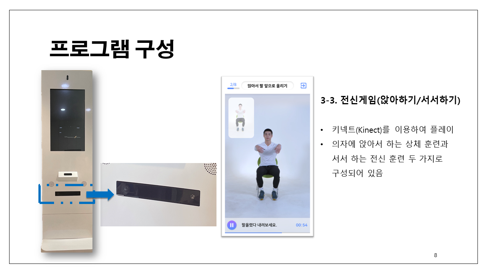

# 🧑‍⚕️ 보자마자 케어 (Bojamaja Care)

**키오스크 기반 치매 예방 & 뇌훈련 콘텐츠**

보자마자 케어는 Kinect, Leap Motion, 카메라 기반 얼굴 인식, 터치스크린 입력을 통합한 **실버 세대 맞춤형 뇌훈련·운동 시스템**입니다.
사용자는 로그인 후 치매 예방 체조, 손 인식 게임, 터치 기반 인지 게임, 전신 운동을 수행하며 **운동 기록과 레포트**를 확인할 수 있습니다.

## 📅 개발 개요

| 구분             | 내용                                                                                                       |
| -------------- | -------------------------------------------------------------------------------------------------------- |
| **개발 기간 / 역할** | **2022.03 \~ 2022.10 (총 8개월)**<br>팀 프로젝트 (개발인원 4명)<br>**UI/흐름 설계, 얼굴 인식 모듈, 터치 & 손 인식 게임, 운동 기록 시스템 개발** |
| **플랫폼**        | Windows 기반 전용 키오스크                                                                                       |

## ⚙️ 기술 스택

| 항목       | 기술                            |
| -------- | ----------------------------- |
| 개발 환경    | Unity 2022.3 LTS, C#          |
| 전신 인식    | Kinect SDK                    |
| 손 인식     | Leap Motion SDK               |
| 얼굴 인식    | OpenCV (EmguCV) + 카메라         |
| UI/애니메이션 | Unity UI, DOTween             |
| 데이터 저장   | SQLite, PlayerPrefs           |
| 영상/사운드   | UnityEngine.Video, AudioMixer |


## 🔍 코드 구조 (모듈별 설명)

### 1. 로그인 & 회원 시스템

* 카메라를 통한 얼굴 인식 → 사용자 프로필 매칭
* 게스트 모드 / 회원 모드 지원
* 훈련 기록 DB(SQLite) 연동

```csharp
if (FaceRecognizer.Instance.Match(userFace))
{
    UserManager.Instance.Login(userId);
    UIManager.Instance.ShowDashboard();
}
```

### 2. 터치 기반 뇌훈련 게임 (TouchGame)

* 숫자판 터치, 단어 연결, 도형 매칭 등 다양한 인지 훈련 제공
* UI 이벤트 기반 게임 로직

```csharp
public void OnCellClick(int index)
{
    if (index == currentTarget)
    {
        score++;
        HighlightNextCell();
    }
    else
    {
        ShowErrorFeedback();
    }
}
```

### 3. 손 인식 게임 (Leap Motion)

* Leap Motion Controller 활용
* 손 제스처(가위/바위/보, 깃발 들기 등)를 인식 후 게임 로직과 매칭

```csharp
void Update()
{
    Frame frame = provider.CurrentFrame;
    foreach (Hand hand in frame.Hands)
    {
        if (hand.IsRight && hand.GrabStrength < 0.2f)
            RaiseFlag();
    }
}
```

### 4. 전신 운동 게임 (Kinect)

* 앉기/서기, 스트레칭 등 전신 동작을 Kinect로 인식
* Joint 좌표 기반으로 동작 판정

```csharp
if (kinectData.Body.Joints[JointType.KneeRight].Position.Y < sitThreshold)
{
    ExerciseManager.Instance.CompleteAction("SitDown");
}
```
### 5. 결과/레포트 시스템

* SQLite에 훈련 점수 & 횟수 저장
* 누적/월별 훈련 기록 조회 후 UI 반영

```csharp
string query = "SELECT COUNT(*) FROM Training WHERE UserId=@id AND Month=@month";
int trainingCount = db.ExecuteScalar<int>(query, new { id = userId, month = currentMonth });
```
## 📂 프로젝트 구조

```
BojamajaCare/
├── Managers/
│   ├── GameManager.cs          # 전체 게임 진행 관리
│   ├── UserManager.cs          # 회원/게스트 관리
│   ├── ExerciseManager.cs      # 운동 진행 및 판정
│   └── DBManager.cs            # SQLite 연동
│
├── Modules/
│   ├── FaceRecognition.cs      # 카메라/얼굴 인식
│   ├── TouchGame.cs            # 터치 기반 뇌훈련 게임
│   ├── LeapMotionGame.cs       # 손 인식 게임
│   ├── KinectExercise.cs       # 전신 운동
│   └── ReportSystem.cs         # 훈련 결과 및 레포트
│
├── UI/
│   ├── UIManager.cs            # 화면 전환
│   ├── LoginUI.cs              # 로그인/회원가입 UI
│   └── ReportUI.cs             # 결과 확인 UI
```

## 📸 스크린샷 & 개발 포인트
| 화면                 | 설명                             | 이미지                                            | 개발 포인트                                                     |
| ------------------ | ------------------------------ | ---------------------------------------------- | ---------------------------------------------------------- |
| **메인 로그인 화면**      | 게스트 입장, 회원가입, 얼굴 인식 로그인 제공     |  | OpenCV + 카메라 모듈을 통한 **얼굴 인식 기반 로그인** 기능 구현, 회원 DB 연동       |
| **치매 예방 체조**       | 로그인 없이도 간단하게 따라 할 수 있는 체조 콘텐츠  |  | VideoPlayer + AudioMixer를 활용해 **동작/음성 동기화 시스템** 개발         |
| **터치 기반 게임**       | 숫자/도형/단어 맞추기 등 인지 훈련 콘텐츠       |  | Unity UI + EventSystem을 활용한 **터치 인식 로직**, 난이도별 문제 로딩 모듈 구현 |
| **손 인식 게임**        | Leap Motion 기반, 손가락 제스처와 깃발 게임 |  | Leap Motion API로 **손가락 제스처 추적** 및 게임 내 액션 매핑 로직 개발         |
| **전신 운동 (Kinect)** | 앉기/서기/스트레칭 판정 기능 포함            |  | Kinect Joint 데이터를 기반으로 **자세 인식 및 판정 알고리즘** 구현              |
| **운동 레포트**         | 훈련 횟수·점수 기록을 그래프로 제공           |  | SQLite + PlayerPrefs로 **훈련 기록 저장/조회 기능** 구현, 그래프 시각화       |

## 🙋‍♂️ 담당 업무 및 기여도

| 기간            | 기여 내용                                  |
| ------------- | -------------------------------------- |
| 2022.03 \~ 05 | 키오스크 UI/흐름 설계, 회원가입/얼굴 인식 로그인 모듈 개발    |
| 2022.06 \~ 07 | 터치 게임(숫자판/퍼즐) 및 손 인식 게임(깃발, 손가락 체조) 개발 |
| 2022.08 \~ 09 | Kinect 기반 전신 운동 콘텐츠 구현 및 판정 로직 개발      |
| 2022.10       | 운동 레포트, DB 연동, QA 및 전시 배포              |
